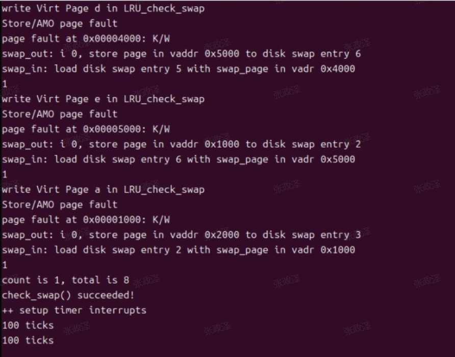

<h1 align = "center">操作系统lab3</h1>

<h3 align = "center">实验名称：缺页异常和页面置换</h3>

<h4 align = "center">成员：张政泽  马有朝  蔡鸿</h4>

## 一、实验目的

* 了解虚拟内存的Page Fault异常处理实现
* 了解页替换算法在操作系统中的实现
* 学会如何使用多级页表，处理缺页异常（Page Fault），实现页面置换算法。

## 二、实验过程

### 1.练习1：理解基于FIFO的页面替换算法（思考题）

- **do_pgfault()**

  访问页面缺失时，最先进入该函数进行处理。当进程出现缺页故障被异常检测机制捕获后，异常处理程序会把Page Fault分发给kern/mm/vmm.c的do_pgfault()函数并尝试进行页面置换
  
- **find_vma()**

  确定引发页故障的地址 addr 是否在某个有效的 VMA 范围内（通过遍历VAM链表），如果 addr 不在任何 VMA 范围内，说明这是一个无效的地址，处理程序会打印错误信息并返回失败。

- **get_pte()**

  获取页表项并返回该页表项的内核虚拟地址，如果包含该页表项的页表不存在，则分配一个页面作为页表，即依次判断，二级页目录项，一级页目录项，页表项是否存在，若不存在则分配新的项给这些部分。

- **pgdir_alloc_page()**

  调用 alloc_page 和 page_insert 函数来分配一个页面大小的内存，并设置一个地址映射将物理地址 pa 映射到线性地址 la，并使用页目录表 pgdir

- **swap in()**

  负责将一个页面从交换文件系统中换回到内存中。这个过程包括分配一个新的内存页、读取交换文件系统中的页面内容、更新页表项，并返回换回的页面

- **swapfs_read()**

  将指定的页面数据写入交换设备包含参数entry：交换条目，包含页面的偏移信息；page：源页面结构，包含要写入的数据；swap_offset(entry)：计算交换条目对应的偏移量；ide_write_secs：调用 IDE 磁盘模拟器的写入函数，将 page 对应的物理地址中的数据写入交换设备

- **page_insert()**

  根据换入的页面和va，建立物理地址与线性地址的映射，同时调用tlb_invalidate()刷新TLB

- **swap_map_swappable()**

  换入页面之后调用页面替换管理器的 map_swappable 方法，把换入的页面加入到FIFO的交换页队列中

- **swap out()**

  将指定数量的页面从内存中换出到交换文件系统中。这个过程包括选择要换出的页面、将页面内容写入交换文件系统、更新页表项，并释放内存页。

- **swap_out_victim()**

  该函数使用了FIFO页面置换算法，在swap out()中被调用，用于寻找页面替换算法选择要换出的页面。

- **swapfs_write()**

  把要换出页面的内容保存到硬盘中。

- **tlb_invalidate()**

  当页面换入还出后，原先的TLB自动实效，此时调用该函数，手动刷新TLB（该函数内部调用了tlb_flash()）

- **list_add()**

  在FIFO具体实现中，为了将新的页面插入队列中而调用的函数。实际上是插入head指针的后面。

### 2.练习2：深入理解不同分页模式的工作原理（思考题）


#### 2.1 get_pte()代码的相似性思考
1. **sv32**:
    - 32位地址空间
    - 两级页表
    - 页大小为 4KB
    - 地址格式：| 10 bits PPN1 | 10 bits PPN0 | 12 bits offset |

2. **sv39**:
    - 39位地址空间
    - 三级页表
    - 页大小为 4KB
    - 地址格式：| 9 bits PPN2 | 9 bits PPN1 | 9 bits PPN0 | 12 bits offset |

3. **sv48**:
    - 48位地址空间
    - 四级页表
    - 页大小为 4KB
    - 地址格式：| 9 bits PPN3 | 9 bits PPN2 | 9 bits PPN1 | 9 bits PPN0 | 12 bits offset |

根据三种分页机制的结构可知，它们都采用了类似的多级页表结构，只是因为地址空间位数不同使分页大小和数目i不一致，因此它们在页表中查找或创建页表项的操作应该是类似的。
无论是在 SV32、SV39 还是 SV48 中，想要在页表中查找或创建页表项，以实现对指定线性地址对应的物理页的访问和映射操作，都需要逐级检查和创建页表项，直到找到或创建目标页表项

在 get_pte 函数中，两段相似的代码分别处理页表项的查找和创建，具体如下：

    查找页表项：
        首先根据虚拟地址计算出各级页表的索引。
        检查每级页表项是否有效（即 PTE_V 位是否被设置）。
        如果某一级页表项无效，则需要创建新的页表。
    
    创建页表项：
        如果某一级页表项无效，分配新的页表页。
        更新页表项，使其指向新分配的页表页。
        继续向下一级页表查找或创建页表项。

本质上是因为sv39的三级页表的机制，结合虚拟地址la，使用pgdir即satp对应的初始页表。利用PDX1,PDX0即二级页目录，页目录和页表的索引，依次找到对应的页目录或者页表项。


#### 2.2 get_pte()将页表项将查找和分配合并的合理性

```c++
pte_t *ptep = NULL;
   
    /* blablabla */
    
    ptep = get_pte(mm->pgdir, addr, 1); //(1) try to find a pte, if pte's
                                        // PT(Page Table) isn't existed, then
                                        // create a PT.
    if (*ptep == 0) //若
    {
        if (pgdir_alloc_page(mm->pgdir, addr, perm) == NULL)
        {
            cprintf("pgdir_alloc_page in do_pgfault failed\n");
            goto failed;
        }
    }
    else
    {
        /* 正常处理 */
    }
```

如上方do_pgfault()函数部分代码所示，使用get_pte()时机一般是发生缺页异常时候的处理。可以发现此时通过get_pte()获取到了出现异常的虚拟地址对应的页表项，然后判断其*ptep == 0即页表项内容是否为空，即是否是刚刚才创建出来的页表项。
如果将查找和分配分开，也就是说查找函数直接返回结果那么也就是NULL，外部调用者只知道某个页表项不存在，但无法知道具体是在哪一级页表项缺失。例如，在 SV39 中，如果第一级页表项缺失，查找函数会返回 NULL，但如果第二级或第三级页表项缺失，查找函数同样会返回 NULL。外部调用者无法区分这些情况。若要处理这种情况，需要额外时间开销来处理，得不偿失。
而如果在查找过程中同时进行分配，可以在发现缺失时立即进行补充，避免了后续的重复查找。例如，在 SV39 中，如果第一级页表项缺失，可以直接分配新的第二级页表；如果第二级页表项缺失，可以直接分配新的第三级页表。此外，合并后的代码更加简洁，逻辑更加清晰。每个步骤都在同一个函数中完成，减少了函数调用的开销。

### 3.练习3：给未被映射的地址映射上物理页（需要编程）
#### 3.1 补充完成do_pgfault（mm/vmm.c）函数

swap_in函数分配一个内存页，然后根据PTE中的swap条目的addr，找到磁盘页的地址，将磁盘页的内容读入这个内存页；
page_insert函数建立一个Page的物理地址与虚拟地址的映射；
最后swap_map_swappable函数设置该页面可交换。

```c++
if (swap_init_ok) {
    struct Page *page = NULL;
    // 你要编写的内容在这里，请基于上文说明以及下文的英文注释完成代码编写
    //(1）According to the mm AND addr, try
    //to load the content of right disk page
    //into the memory which page managed.
    //(2) According to the mm,
    //addr AND page, setup the
    //map of phy addr <--->
    //logical addr
    //(3) make the page swappable.

    swap_in(mm,addr,&page);
    page_insert(mm->pgdir,page,addr,perm);
    swap_map_swappable(mm,addr,page,1);
    
    page->pra_vaddr = addr;
} else {
    cprintf("no swap_init_ok but ptep is %x, failed\n", *ptep);
    goto failed;
}
```

#### 3.2 请描述页目录项（Page Directory Entry）和页表项（Page Table Entry）中组成部分对ucore实现页替换算法的潜在用处。

 页目录项和页表项通常包含以下信息：
 * 页表基地址：指向一个或多个页表的基地址，这些页表负责映射更高层次的虚拟地址空间到物理地址空间。
 * 物理页面帧号：指向物理内存中的具体位置。
 * 访问权限标志（PTE_R、PTE_W、PTE_X）：指示页面是否可读、可写或可执行。
 * 存在位（PTE_V）：表示该页表是否存在于物理内存中。
 * 修改位（PTE_D）：如果页面被修改过，则此位会被设置。
 * 访问位（PTE_A）：表示页面是否最近被访问过。

 修改位和访问位可以帮助操作系统确定哪些页面最近没有被使用过，或者哪些页面已经被修改但还没有写回磁盘。在改进的时钟（Enhanced Clock）页替换算法当中，需要替换页面时，系统可以借助着两位标志位优先考虑那些最近未被访问且未被修改的页面，这样可以减少不必要的磁盘I/O操作。

#### 3.3 如果ucore的缺页服务例程在执行过程中访问内存，出现了页访问异常，请问硬件要做哪些事情？

 CPU会把产生异常的线性地址存储在CR2寄存器中，并且把表示页访问异常类型的error Code保存在中断栈中。之后通过上述分析的trap–> trap_dispatch–>pgfault_handler–>do_pgfault调用关系，一步步做出处理。

#### 3.4 数据结构 Page 的全局变量（其实是一个数组）的每一项与页表中的页目录项和页表项有无对应关系？

 page结构体：
```c++
struct Page {
    int ref;                        // page frame's reference counter
    uint_t flags;        // array of flags that describe the status of the page frame
    uint_t visited;
    unsigned int property;    // the num of free block, used in first fit pm manager
    list_entry_t page_link;         // free list link
    list_entry_t pra_page_link;     // used for pra (page replace algorithm)
    uintptr_t pra_vaddr;            // used for pra (page replace algorithm)
};
```

其中我们使用了一个visited变量，用来记录页面是否被访问。 在map_swappable函数，我们把换入的页面加入到FIFO的交换页队列中，此时页面已经被访问，visited置为1.

在clock_swap_out_victim，我们根据算法筛选出可用来交换的页面。

在CLOCK算法我们使用了visited成员：我们从队尾依次遍历到队头，查看visited变量，如果是0，则该页面可以被用来交换，把它从FIFO页面链表中删除。

由于PTE_A 表示内存页是否被访问过，visited与其对应。


### 4.练习4：补充完成Clock页替换算法（需要编程）

- **_clock_init_mm**

```c
static int
_clock_init_mm(struct mm_struct *mm)
{     
     /*LAB3 EXERCISE 4: YOUR CODE*/ 
     // 初始化pra_list_head为空链表
     list_init(&pra_list_head);
     // 初始化当前指针curr_ptr指向pra_list_head，表示当前页面替换位置为链表头
     curr_ptr = &pra_list_head;
     // 将mm的私有成员指针指向pra_list_head，用于后续的页面替换算法操作
     mm->sm_priv = &pra_list_head;
     //cprintf(" mm->sm_priv %x in fifo_init_mm\n",mm->sm_priv);
     return 0;
}
/*
```

- **_clock_map_swappable**

```c
static int
_clock_map_swappable(struct mm_struct *mm, uintptr_t addr, struct Page *page, int swap_in)
{
    list_entry_t *entry=&(page->pra_page_link);

    assert(entry != NULL && curr_ptr != NULL);
    //record the page access situlation
    /*LAB3 EXERCISE 4: YOUR CODE*/ 
    // link the most recent arrival page at the back of the pra_list_head qeueue.
    // 将页面page插入到页面链表pra_list_head的末尾
    list_add_before(mm->sm_priv, entry);
    //list_add_before(curr_ptr, entry);
    // 将页面的visited标志置为1，表示该页面已被访问
    page->visited = 1;

    return 0;
}
```

- **_clock_swap_out_victim**

```c
static int
_clock_swap_out_victim(struct mm_struct *mm, struct Page ** ptr_page, int in_tick)
{
     list_entry_t *head=(list_entry_t*) mm->sm_priv;
         assert(head != NULL);
     assert(in_tick==0);
     /* Select the victim */
     //(1)  unlink the  earliest arrival page in front of pra_list_head qeueue
     //(2)  set the addr of addr of this page to ptr_page
    //list_entry_t * entry = list_prev(mm->sm_priv);
    while (1) {
        /*LAB3 EXERCISE 4: YOUR CODE*/ 
        // 编写代码
        // 遍历页面链表pra_list_head，查找最早未被访问的页面
        if(curr_ptr == head) {
            curr_ptr = list_next(curr_ptr);
            continue;
        }
        // 获取当前页面对应的Page结构指针
        struct Page* page = le2page(curr_ptr, pra_page_link);
        // 如果当前页面未被访问，则将该页面从页面链表中删除，并将该页面指针赋值给ptr_page作为换出页面
        if(page->visited == 0) {
            list_entry_t * temp =curr_ptr;
            cprintf("curr_ptr %p\n",curr_ptr);
            // 将当前指针curr_ptr指向被删除页面的下一个页面
            curr_ptr = list_next(curr_ptr);
            // 将被删除页面从页面链表中删除
            list_del(temp);
            // 将被删除页面的指针赋值给ptr_page
            *ptr_page = page;

            return 0;
        }
        // 如果当前页面已被访问，则将visited标志置为0，表示该页面已被重新访问
        page->visited = 0;
        // 将当前指针curr_ptr指向被删除页面的下一个页面
        curr_ptr = list_next(curr_ptr);
    }
    return 0;
}
```

• **比较 Clock 页替换算法和 FIFO 算法的不同。**
- **FIFO替换算法**
- 基本原理：
    * FIFO 算法：总是淘汰最先进入内存的页，即选择在内存中驻留时间最久的页予以淘汰
    * 实现：将已调入内存的页按先后次序链接成一个队列，队列头指向内存中驻留时间最久的页，队列尾指向最近被调入内存的页。需要淘汰页时，从队列头很容易查找到需要淘汰的页
- 优点：
    * 实现简单：只需要一个队列来记录页面进入内存的顺序
    * 易于理解：算法逻辑简单，容易实现和调试
- 缺点：
    * 效率不高：在非线性访问模式下，经常访问的页可能会因为驻留时间长而被置换出去
    * Belady 异常：在某些情况下，增加内存容量反而会增加缺页中断次数。这是由于 FIFO 算法没有考虑页面的访问频率和局部性原理

- **Clock替换算法**
- 基本原理：
    * Clock 算法：是 LRU 算法的一种近似实现。将各个页面组织成环形链表的形式，类似于一个钟的表面。设置一个指针（当前指针）指向最老的那个页面，即最先进来的那个页面
    * 实现：将已调入内存的页按先后次序链接成一个队列，队列头指向内存中驻留时间最久的页，队列尾指向最近被调入内存的页。需要淘汰页时，从队列头很容易查找到需要淘汰的页
- 优点：
    * 近似 LRU：通过访问位的设置，近似地实现了 LRU 的思想，能够更好地反映页面的最近使用情况
    * 易于实现：相对于真正的 LRU 算法，Clock 算法实现简单，开销少
    * 避免 Belady 异常：Clock 算法通过访问位的管理，避免了 FIFO 算法中的 Belady 异常现象
- 缺点：
    * 实现复杂：需要管理访问位和时钟指针，相对于 FIFO 算法实现稍显复杂


### 5.练习5：阅读代码和实现手册，理解页表映射方式相关知识（思考题）
1. 好处和优势：

- **减少页表管理开销**：使用一个大页的页表映射方式减少了需要管理的页表项数量，降低了页表管理的复杂性和开销
- **提高内存访问性能**：大页映射减少了页表的层数，从而减少了地址转换时的页表查找次数。这可以显著提高内存访问速度
- **简化内存管理**：大页映射简化了内存分配和释放的过程，因为需要管理的页表项数量减少，减少了内存管理的复杂性
- **减少TLB缺失**：由于大页涵盖的物理内存范围更大，TLB中的一个条目可以映射更大的内存范围，从而可能减少TLB缺失的次数。

### 坏处和风险：
- **浪费内存**：大页映射使用固定大小的页面，可能导致内存浪费，如果应用程序只需要小部分的大页，则剩余的部分将被浪费，导致内存碎片。
- **灵活性降低**：大页映射的固定大小使得它难以适应内存需求的动态变化。例如，如果应用程序的内存需求突然增加，可能需要分配多个大页，这可能导致内存分配失败，此外，
    在多任务环境中，不同任务的内存需求可能差异很大，大页映射可能无法有效地满足所有任务的需求
- **增加内存压力**：由于每个大页都需要大量的连续内存，因此可能会增加内存分配的压力和碎片化
- **增加初始分配开销**：大页映射可能需要预先分配大量内存，这可能导致系统在启动时占用更多的内存资源

### 6.challenge：实现不考虑实现开销和效率的LRU页替换算法（需要编程）

* **swap_LRU.c**

```c++
#include <defs.h>
#include <riscv.h>
#include <stdio.h>
#include <string.h>
#include <swap.h>
#include <swap_LRU.h>
#include <list.h>


list_entry_t pra_list_head;
/*
 * 
 */

// 初始化LRU页面替换算法
static int
_LRU_init_mm(struct mm_struct *mm)
{     
     list_init(&pra_list_head);
     mm->sm_priv = &pra_list_head;
     //cprintf(" mm->sm_priv %x in fifo_init_mm\n",mm->sm_priv);
     return 0;
}
/*
 * 
 */
static int
_LRU_map_swappable(struct mm_struct *mm, uintptr_t addr, struct Page *page, int swap_in)
{
    list_entry_t *head=(list_entry_t*) mm->sm_priv;
    list_entry_t *entry=&(page->pra_page_link);
 
    assert(entry != NULL && head != NULL);
    //record the page access situlation

    //(1)link the most recent arrival page at the back of the pra_list_head qeueue.
    list_add(head, entry);
    return 0;
}
/*
 *  
 */
static int
_LRU_swap_out_victim(struct mm_struct *mm, struct Page ** ptr_page, int in_tick)
{
    list_entry_t *head=(list_entry_t*) mm->sm_priv;
         assert(head != NULL);
     assert(in_tick==0);
     /* Select the victim */
     //(1)  unlink the  earliest arrival page in front of pra_list_head qeueue
     //(2)  set the addr of addr of this page to ptr_page
    list_entry_t* entry = list_prev(head);
    if (entry != head) {
        list_del(entry);
        *ptr_page = le2page(entry, pra_page_link);
    } else {
        *ptr_page = NULL;
    }
    return 0;
}
/// @brief 核心思想是当访问某个页面时，将这个页面对应的page放到链表头的下一个，然后在每次分配时都分配链表头的前一个也就是链表中的最后一个
/// @param mm 
/// @param page 
/// @return 
static inline bool 
_LRU_update_list(struct mm_struct *mm, uintptr_t addr) {
    ///找到这个page，把这个page提到链表的最后即head->before
    list_entry_t *head=(list_entry_t*) mm->sm_priv;
    assert(head != NULL);
    
    list_entry_t *entry = head->next;
    while (entry != head) {
        if (PPN(le2page(entry,pra_page_link)->pra_vaddr) == PPN(addr)) {
            list_del(entry);
            list_add(head, entry);
            return true;
        }
        entry = list_next(entry);

    }
    return false;
}
static inline void
check_content_set_SUB(struct mm_struct *mm,uintptr_t addr,int value){
     *(unsigned char *)addr = value;///访问地址addr
     bool bo=_LRU_update_list(mm,addr);
     cprintf("%d\n",bo);
}
static int
_LRU_check_swap() {    
    extern struct mm_struct *check_mm_struct;  
#ifdef ucore_test
    int score = 0, totalscore = 5;
    cprintf("%d\n", &score);
    ++ score; cprintf("grading %d/%d points", score, totalscore);
    *(unsigned char *)0x3000 = 0x0c;
    assert(pgfault_num==4);
    *(unsigned char *)0x1000 = 0x0a;
    assert(pgfault_num==4);
    *(unsigned char *)0x4000 = 0x0d;
    assert(pgfault_num==4);
    *(unsigned char *)0x2000 = 0x0b;
    ++ score; cprintf("grading %d/%d points", score, totalscore);
    assert(pgfault_num==4);
    *(unsigned char *)0x5000 = 0x0e;
    assert(pgfault_num==5);
    *(unsigned char *)0x2000 = 0x0b;
    assert(pgfault_num==5);
    ++ score; cprintf("grading %d/%d points", score, totalscore);
    *(unsigned char *)0x1000 = 0x0a;
    assert(pgfault_num==5);
    *(unsigned char *)0x2000 = 0x0b;
    assert(pgfault_num==5);
    *(unsigned char *)0x3000 = 0x0c;
    assert(pgfault_num==5);
    ++ score; cprintf("grading %d/%d points", score, totalscore);
    *(unsigned char *)0x4000 = 0x0d;
    assert(pgfault_num==5);
    *(unsigned char *)0x5000 = 0x0e;
    assert(pgfault_num==5);
    assert(*(unsigned char *)0x1000 == 0x0a);
    *(unsigned char *)0x1000 = 0x0a;
    assert(pgfault_num==6);
    ++ score; cprintf("grading %d/%d points", score, totalscore);
#else 
    check_content_set_SUB(check_mm_struct,0x3000,0x0c);
    assert(pgfault_num==4);
    check_content_set_SUB(check_mm_struct,0x1000,0x0a);
    assert(pgfault_num==4);
    check_content_set_SUB(check_mm_struct,0x4000,0x0d);
    assert(pgfault_num==4);
    check_content_set_SUB(check_mm_struct,0x2000,0x0b);
    assert(pgfault_num==4);
    check_content_set_SUB(check_mm_struct,0x5000,0x0e);
    assert(pgfault_num==5);
    check_content_set_SUB(check_mm_struct,0x2000,0x0b);
    assert(pgfault_num==5);
    check_content_set_SUB(check_mm_struct,0x1000,0x0a);
    assert(pgfault_num==5);
    check_content_set_SUB(check_mm_struct,0x2000,0x0b);
    assert(pgfault_num==5);
    check_content_set_SUB(check_mm_struct,0x3000,0x0c);
    assert(pgfault_num==6);
    check_content_set_SUB(check_mm_struct,0x4000,0x0d);
    assert(pgfault_num==7);
    check_content_set_SUB(check_mm_struct,0x5000,0x0e);
    assert(pgfault_num==8);
    check_content_set_SUB(check_mm_struct,0x1000,0x0a);
    assert(pgfault_num==9);
#endif
    return 0;
}


static int
_LRU_init(void)
{
    return 0;
}

static int
_LRU_set_unswappable(struct mm_struct *mm, uintptr_t addr)
{
    return 0;
}

static int
_LRU_tick_event(struct mm_struct *mm)
{ return 0; }


struct swap_manager swap_manager_LRU =
{
     .name            = "LRU swap manager",
     .init            = &_LRU_init,
     .init_mm         = &_LRU_init_mm,
     .tick_event      = &_LRU_tick_event,
     .map_swappable   = &_LRU_map_swappable,
     .set_unswappable = &_LRU_set_unswappable,
     .swap_out_victim = &_LRU_swap_out_victim,
     .check_swap      = &_LRU_check_swap,
     .update_swap_cnt = &_LRU_update_list,
};

```

swap_LRU.c的代码在swap_fifo.c代码的基础上实现了LRU页面替换算法，在代码中新增加了函数_LRU_update_list、check_content_set_SUB以及重新设置了相应的_LRU_check_swap函数。

另外注意到，在代码最后的swap_manager结构体swap_manager_LRU中，新增了一个Item--.update_swap_cnt = &_LRU_update_list,目的是使得函数_LRU_update_list可以作为接口，可供外部调用。修改了此struct后，相应地也要在swap.h头文件中修改swap_manager的声明部分，如下所示：

```c++
struct swap_manager
{
     const char *name;
     /* Global initialization for the swap manager */
     int (*init)            (void);
     /* Initialize the priv data inside mm_struct */
     int (*init_mm)         (struct mm_struct *mm);
     /* Called when tick interrupt occured */
     int (*tick_event)      (struct mm_struct *mm);
     /* Called when map a swappable page into the mm_struct */
     int (*map_swappable)   (struct mm_struct *mm, uintptr_t addr, struct Page *page, int swap_in);
     /* When a page is marked as shared, this routine is called to
      * delete the addr entry from the swap manager */
     int (*set_unswappable) (struct mm_struct *mm, uintptr_t addr);
     /* Try to swap out a page, return then victim */
     int (*swap_out_victim) (struct mm_struct *mm, struct Page **ptr_page, int in_tick);
     /* check the page relpacement algorithm */
     int (*check_swap)();     
     /* update swap list */
     bool (*update_swap_cnt)(struct mm_struct *mm, uintptr_t addr);
};
```

#### LRU页面替换算法设计思路：

​	LRU(Least Recently Used)页面替换算法的核心思想是当需要替换页面时，选择最长时间未被使用的页面进行替换。

​	在具体实现上，与fifo页面替换算法一致，同样采用维护一个链表的方式。

​    init函数：初始化LRU页面替换算法的链表为空表，并令mm_struct结构体的sm_priv指针指向此链表。

```c++
// 初始化LRU页面替换算法
static int
_LRU_init_mm(struct mm_struct *mm)
{     
     list_init(&pra_list_head);
     mm->sm_priv = &pra_list_head;
     //cprintf(" mm->sm_priv %x in fifo_init_mm\n",mm->sm_priv);
     return 0;
}
```

​		_LRU_map_swappable函数:此函数的作用是将某个页面设置为可交换状态，也就是将其加入到链表pra_list_head当中。在这里我们选择将每个新加入的页面放置到链表头的下一个，然后在每次需要从链表中寻找页面换出时，我们选择链表头的前一个页面，也就是链表中的最后一个页面(这个页面被认为是最久未使用的)。

```c++
static int
_LRU_map_swappable(struct mm_struct *mm, uintptr_t addr, struct Page *page, int swap_in)
{
    list_entry_t *head=(list_entry_t*) mm->sm_priv;
    list_entry_t *entry=&(page->pra_page_link);
 
    assert(entry != NULL && head != NULL);
    //record the page access situlation

    //(1)link the most recent arrival page at the back of the pra_list_head qeueue.
    list_add(head, entry);
    return 0;
}
```

​		_LRU_swap_out_victim函数:此函数的作用是当需要进行页面替换时，挑出一个页面供替换。在此函数的实现中，我们挑选的页面是链表头的前一个页面，也就是链表末尾的那个页面，这个页面被认为是最久未使用的页面。

```c++
static int
_LRU_swap_out_victim(struct mm_struct *mm, struct Page ** ptr_page, int in_tick)
{
    list_entry_t *head=(list_entry_t*) mm->sm_priv;
         assert(head != NULL);
     assert(in_tick==0);
     /* Select the victim */
     //(1)  unlink the  earliest arrival page in front of pra_list_head qeueue
     //(2)  set the addr of addr of this page to ptr_page
    list_entry_t* entry = list_prev(head);
    if (entry != head) {
        list_del(entry);
        *ptr_page = le2page(entry, pra_page_link);
    } else {
        *ptr_page = NULL;
    }
    return 0;
}
```

​		_LRU_update_list函数：该函数的作用是更新此时的链表状态。当某个地址被访问后，紧接着会间接调用此函数，通过将访问的地址作为参数传递进该函数，接着在函数中会通过逐个遍历的方式在链表中查找此地址对应的页面，当找到此页面时便会将此页面提到此链表的最前方(链表头的下一个)表示这个页面最近被访问。

```c++
static inline bool 
_LRU_update_list(struct mm_struct *mm, uintptr_t addr) {
    ///找到这个page，把这个page提到链表的最后即head->before
    list_entry_t *head=(list_entry_t*) mm->sm_priv;
    assert(head != NULL);
    
    list_entry_t *entry = head->next;
    while (entry != head) {
        if (PPN(le2page(entry,pra_page_link)->pra_vaddr) == PPN(addr)) {
            list_del(entry);
            list_add(head, entry);
            return true;
        }
        entry = list_next(entry);

    }
    return false;
}
```

​	check_content_set_SUB函数：此函数的作用是设置某个地址addr处的值为value，并更新页面替换算法中维护的链表状态。这一函数将在下面的check函数中被使用。

```c++
static inline void
check_content_set_SUB(struct mm_struct *mm,uintptr_t addr,int value){
     *(unsigned char *)addr = value;///访问地址addr
     bool bo=_LRU_update_list(mm,addr);
     cprintf("%d\n",bo);
}
```

#### LRU页面替换算法check验证：

​		对LRU页面替换算法的check函数的调用在swap.c的check函数当中。在swap.c函数中首先会调用check_content_set()函数进行基本的检查，接下来会通过调用check_content_access函数间接地调用swap_LRU.c中的check函数。下面分别分析基本的check函数及页面替换算法的check函数的检查逻辑。

```c++
static inline void
check_content_set(void)
{
     check_content_set_SUB(check_mm_struct,0x1000,0x0a);
     assert(pgfault_num==1);
     check_content_set_SUB(check_mm_struct,0x1010,0x0a);
     assert(pgfault_num==1);
     check_content_set_SUB(check_mm_struct,0x2000,0x0b);
     assert(pgfault_num==2);
     check_content_set_SUB(check_mm_struct,0x2010,0x0b);
     assert(pgfault_num==2);
     check_content_set_SUB(check_mm_struct,0x3000,0x0c);
     assert(pgfault_num==3);
     check_content_set_SUB(check_mm_struct,0x3010,0x0c);
     assert(pgfault_num==3);
     check_content_set_SUB(check_mm_struct,0x4000,0x0d);
     assert(pgfault_num==4);
     check_content_set_SUB(check_mm_struct,0x4010,0x0d);
     assert(pgfault_num==4);
}
```

```c++
static int
_LRU_check_swap() {    
    extern struct mm_struct *check_mm_struct;  
#ifdef ucore_test
    int score = 0, totalscore = 5;
    cprintf("%d\n", &score);
    ++ score; cprintf("grading %d/%d points", score, totalscore);
    *(unsigned char *)0x3000 = 0x0c;
    assert(pgfault_num==4);
    *(unsigned char *)0x1000 = 0x0a;
    assert(pgfault_num==4);
    *(unsigned char *)0x4000 = 0x0d;
    assert(pgfault_num==4);
    *(unsigned char *)0x2000 = 0x0b;
    ++ score; cprintf("grading %d/%d points", score, totalscore);
    assert(pgfault_num==4);
    *(unsigned char *)0x5000 = 0x0e;
    assert(pgfault_num==5);
    *(unsigned char *)0x2000 = 0x0b;
    assert(pgfault_num==5);
    ++ score; cprintf("grading %d/%d points", score, totalscore);
    *(unsigned char *)0x1000 = 0x0a;
    assert(pgfault_num==5);
    *(unsigned char *)0x2000 = 0x0b;
    assert(pgfault_num==5);
    *(unsigned char *)0x3000 = 0x0c;
    assert(pgfault_num==5);
    ++ score; cprintf("grading %d/%d points", score, totalscore);
    *(unsigned char *)0x4000 = 0x0d;
    assert(pgfault_num==5);
    *(unsigned char *)0x5000 = 0x0e;
    assert(pgfault_num==5);
    assert(*(unsigned char *)0x1000 == 0x0a);
    *(unsigned char *)0x1000 = 0x0a;
    assert(pgfault_num==6);
    ++ score; cprintf("grading %d/%d points", score, totalscore);
#else 
    check_content_set_SUB(check_mm_struct,0x3000,0x0c);
    assert(pgfault_num==4);
    check_content_set_SUB(check_mm_struct,0x1000,0x0a);
    assert(pgfault_num==4);
    check_content_set_SUB(check_mm_struct,0x4000,0x0d);
    assert(pgfault_num==4);
    check_content_set_SUB(check_mm_struct,0x2000,0x0b);
    assert(pgfault_num==4);
    check_content_set_SUB(check_mm_struct,0x5000,0x0e);
    assert(pgfault_num==5);
    check_content_set_SUB(check_mm_struct,0x2000,0x0b);
    assert(pgfault_num==5);
    check_content_set_SUB(check_mm_struct,0x1000,0x0a);
    assert(pgfault_num==5);
    check_content_set_SUB(check_mm_struct,0x2000,0x0b);
    assert(pgfault_num==5);
    check_content_set_SUB(check_mm_struct,0x3000,0x0c);
    assert(pgfault_num==6);
    check_content_set_SUB(check_mm_struct,0x4000,0x0d);
    assert(pgfault_num==7);
    check_content_set_SUB(check_mm_struct,0x5000,0x0e);
    assert(pgfault_num==8);
    check_content_set_SUB(check_mm_struct,0x1000,0x0a);
    assert(pgfault_num==9);
#endif
    return 0;
}
```

在swap.c的check函数中，在初始化中设置了CHECK_VALID_PHY_PAGE_NUM=4，也就是链表中最大的页面数为4

在基本的check函数中先后访问了（同时也列出了每次访问后理论上的pagefalut数及链表中的状态）

0x1000, 链表状态:head->0x1000 ,page_fault_num =  1

0x1010, 链表状态:head->0x1000 ,page_fault_num =  1

0x2000, 链表状态:head->0x2000->0x1000 ,page_fault_num =  2

0x2010, 链表状态:head->0x2000->0x1000 ,page_fault_num =  2

0x3000, 链表状态:head->0x3000->0x2000->0x1000 ,page_fault_num =  3

0x3010, 链表状态:head->0x3000->0x2000->0x1000 ,page_fault_num =  3

0x4000, 链表状态:head->0x4000->0x3000->0x2000->0x1000 ,page_fault_num =  4

0x4010, 链表状态:head->0x4000->0x3000->0x2000->0x1000 ,page_fault_num =  4

接下来，页面替换算法的check函数中先后访问了（同时也列出了每次访问后理论上的pagefalut数及链表中的状态）

0x3000, 链表状态:head->0x3000->0x4000->0x2000->0x1000 ,page_fault_num =  4

0x1000, 链表状态:head->0x1000->0x4000->0x3000->0x2000 ,page_fault_num =  4

0x4000, 链表状态:head->0x4000->0x1000->0x3000->0x2000 ,page_fault_num =  4

0x2000, 链表状态:head->0x2000->0x1000->0x4000->0x3000,page_fault_num =  4

0x5000, 链表状态:head->0x5000->0x1000->0x4000->0x3000,page_fault_num =  5

0x2000, 链表状态:head->0x2000->0x5000->0x1000->0x4000,page_fault_num =  5

0x1000,链表状态:head->0x1000->0x2000->0x5000->0x4000,page_fault_num =  5

0x2000,链表状态:head->0x2000->0x1000->0x5000->0x4000,page_fault_num =  5

0x3000,链表状态:head->0x3000->0x2000->0x1000->0x5000,page_fault_num =  6

0x4000,链表状态:head->0x4000->0x3000->0x2000->0x1000,page_fault_num =  7

0x5000,链表状态:head->0x5000->0x4000->0x3000->0x2000,page_fault_num =  8

0x1000,链表状态:head->0x1000->0x5000->0x4000->0x3000,page_fault_num =  9

##### make qemu启动qemu进行测试，结果如下:通过了所有的测试点可以正常运行


## 三、OS重要原理及知识点
### **3.1 页、页表和多级页表机制：**
1. 页（Page）
* 定义

    页：虚拟内存的基本单位，通常是固定大小的块（例如 4KB、2MB 或 4MB）。操作系统将虚拟地址空间划分为多个页，每个页对应一个物理页。

* 功能

    内存隔离：通过页的划分，可以实现不同进程之间的内存隔离，防止一个进程访问另一个进程的内存。
    内存保护：每个页可以设置访问权限（读、写、执行），确保内存的安全性。
    内存管理：页是内存管理的基本单位，可以方便地进行分配、释放和替换。

2. 页表（Page Table）
* 定义

    页表：一个数据结构，用于将虚拟地址映射到物理地址。每个页表项（Page Table Entry, PTE）包含一个虚拟页号（Virtual Page Number, VPN）和一个物理页号（Physical Page Number, PPEN），以及其他控制信息（如访问权限、脏位、使用位等）。

* 功能

    地址转换：页表用于将虚拟地址转换为物理地址。操作系统通过查找页表，将虚拟地址中的虚拟页号映射到物理页号，再结合页内偏移量得到最终的物理地址。
    内存管理：页表记录了每个虚拟页的状态，包括是否在内存中、是否被交换到磁盘等信息，用于内存管理和页面替换。

3. 多级页表（Multi-Level Page Table）
* 定义

    多级页表：一种用于管理大地址空间的页表结构，通过将页表分成多个层次，减少页表的大小和查找时间。

* 功能

    减少页表大小：多级页表通过将页表分成多个层次，减少了单个页表的大小。每个层次的页表只包含下一层页表的索引，而不是直接的物理页号。
    提高查找效率：多级页表通过多级索引，减少了查找页表的时间。每次查找只需要访问少数几个页表项，而不是整个页表。

### **3.2 clock页面置换算法及其改进：**
1. 基本的 Clock 页替换算法
    * 环形链表：将所有页面组织成一个环形链表。
    * 当前指针：一个指针（curr_ptr）指向链表中的某个页面，初始时指向最先进来的页面。
    * 访问位：每个页面的页表项（PTE）中有一个访问位（visited），表示该页面是否被访问过。当页面被访问时，CPU 中的 MMU 硬件将访问位置为 1。
    * 淘汰机制：当需要淘汰页面时，从当前指针开始，逐个检查页面的访问位：如果访问位为 0，淘汰该页面。如果访问位为 1，将访问位清零，继续检查下一个页面。
2. 改进的 Clock 页替换算法
    *  环形链表：将所有页面组织成一个环形链表。
    *  当前指针：一个指针（curr_ptr）指向链表中的某个页面，初始时指向最先进来的页面。
    *  访问位：每个页面的页表项（PTE）中有一个访问位（visited），表示该页面是否被访问过。当页面被访问时，CPU 中的 MMU 硬件将访问位置为 1。
    *  修改位：每个页面的页表项（PTE）中有一个修改位（dirty），表示该页面是否被修改过。当页面被写入时，CPU 中的 MMU 硬件将修改位置为 1。
    *  淘汰机制：从当前指针开始，逐个检查页面的访问位和修改位：如果访问位为 0 且修改位为 0，淘汰该页面。如果访问位为 0 且修改位为 1，淘汰该页面，并将页面写回磁盘。如果访问位为 1，将访问位清零，继续检查下一个页面。
